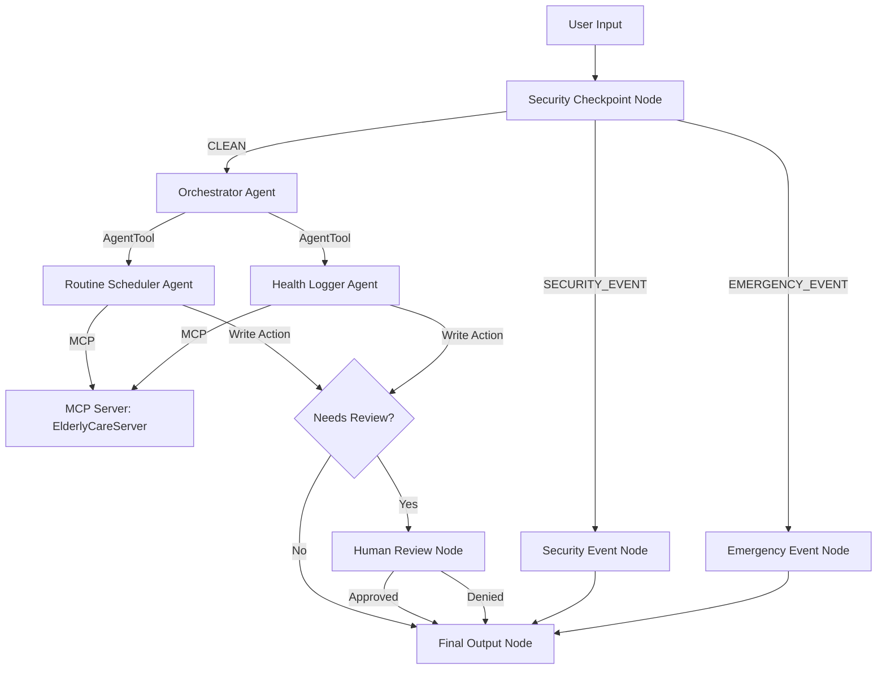

# Submission Write-Up: Elderly Care Assistant

## Problem Statement

As the global population ages, millions of elderly individuals require assistance with managing daily activities, keeping track of medication/meditation schedules, and logging health conditions. Caregivers face high cognitive load coordinating schedules, logging vitals, and updating health logs manually. 

At the same time, any AI assistant interfacing with vulnerable users and sensitive health records must meet strict security and safety standards:
1. Prevent data leaks (PII scrubbing).
2. Safeguard against malicious prompt engineering or system overriding (prompt injection detection).
3. Recognize medical emergencies and immediately escalate them.
4. Establish caregiver oversight for database updates (Human-in-the-Loop approval).

The **Elderly Care Assistant** solves this by providing a conversational AI concierge that automates routines and health logging under a secure, multi-agent, and caregiver-reviewed framework.

## Solution Architecture

The solution uses the following flow for processing user interactions:

## Concepts Used

This application demonstrates full usage of the ADK 2.0 and Agents CLI framework:

1. **ADK 2.0 Workflow**: The entire process is structured as a graph in [agent.py](app/agent.py#L247-L270), defining deterministic transitions, conditional routing dictionary mapping, and multi-node execution.
2. **LlmAgent**: Three separate agents (`orchestrator`, `routine_scheduler`, `health_logger`) are defined in [agent.py](app/agent.py#L38-L81) using `LlmAgent` and loaded with domain-specific system instructions.
3. **AgentTool**: The `orchestrator` delegates tasks to sub-agents using `AgentTool(sub_agent)` in [agent.py](app/agent.py#L81) to orchestrate without manual prompt switching.
4. **MCP Server**: A stdio transport-based FastMCP server is implemented in [mcp_server.py](app/mcp_server.py) to read and write database structures for daily routines and well-being logs.
5. **Security Checkpoint**: The `security_checkpoint` workflow node in [agent.py](app/agent.py#L128-L190) performs PII scrubbing, keywords injection block, and emergency routing.
6. **Agents CLI**: Project configuration, workspace setup, env alignment, and Makefile targets are scaffolded using the `agents-cli` toolkit.

## Security Design

To secure the elderly care domain, the following controls are implemented in the `security_checkpoint`:
- **PII Scrubbing**: Regex patterns scrub Social Security Numbers (SSNs) and phone numbers from user messages, preventing exposure to external LLMs.
- **Prompt Injection Block**: Prevents attempts to bypass constraints (e.g., using keywords like `ignore instructions`, `bypass security`) by routing them to a `SECURITY_EVENT` handler that blocks LLM generation.
- **Structured JSON Audit Logs**: Writes structured logs for security audits containing flags for injection, emergency, and PII detection.
- **Emergency Action Escalation**: Evaluates input against emergency terms (e.g. `chest pain`, `can't breathe`) to bypass standard flow and immediately direct the user to contact 911 or primary caregiver services.

## MCP Server Design

The `ElderlyCareServer` in [mcp_server.py](app/mcp_server.py) exposes the following API tools to the LLMs:
- `get_routines(date: str)`: Fetches scheduled routines and meditation tasks from the JSON DB file.
- `add_routine(date: str, time: str, activity: str)`: Schedules new reminders/appointments.
- `get_health_logs()`: Returns the recent health metrics (blood pressure, symptoms, mood).
- `add_health_log(symptoms: str, mood: str, blood_pressure: str)`: Logs vitals and symptoms.

## Human-in-the-Loop (HITL) Flow

A `check_sensitive_action` callback in [agent.py](app/agent.py#L65-L75) runs after any tool execution. If a mutating tool like `add_routine` or `add_health_log` is called:
1. It flags `needs_review=True` and records the pending action in `ctx.state`.
2. The workflow routes to `human_review_node`, which yields a `RequestInput` event to pause execution.
3. The UI presents an approval prompt to the user/caregiver.
4. Upon receiving `"yes"` or `"approve"`, the action is written to the database, otherwise, the changes are rolled back.

## Demo Walkthrough

The project includes three scenarios verifying functionality:
1. **Normal Flow**: Fetching schedules. Routes: `START` -> `security_checkpoint` (CLEAN) -> `orchestrator` -> `routine_scheduler` -> `get_routines` tool.
2. **Approval Flow**: Creating new health logs. The `add_health_log` tool sets `needs_review=True` which triggers a caregiver review gate.
3. **Blocked Flow**: Input contains `jailbreak` or similar. Routes: `START` -> `security_checkpoint` (SECURITY_EVENT) -> `security_event_node` -> final warning.

## Impact / Value Statement

The **Elderly Care Assistant** lowers care coordination barriers, automates tracking, and reduces caregiver burden. Its combination of granular guardrails (PII and injection guards) and verification checkpointing (caregiver approval) ensures it is both highly capable and exceptionally safe for deployment in healthcare and wellness contexts.
